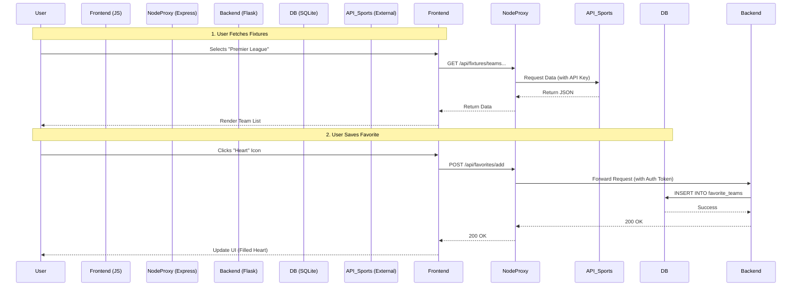

# Application Architecture & Data Handling Documentation

## 1. High-Level Architecture
The Sport Calendar is a **Dual-Backend application** designed to transition from a simple file-based prototype (Node.js) to a robust production system (Python/Flask + SQL).

*   **Frontend**: Vanilla JavaScript (ES6 modules), serving static HTML/CSS.
*   **Web Server (Frontend)**: Node.js/Express (Port 3000). Serves the UI and proxies API requests.
*   **API Server (Backend)**: Python Flask (Port 8000). Handles authentication, database logic, and API-Sports integration.
*   **Database**: SQLite (Development) / PostgreSQL (Production).

---

## 2. Data Handling & Persistence

### A. Python Backend (Primary Database)
The Python backend uses **SQLAlchemy ORM** to manage relational data. This is the source of truth for Users and their Favorites.
In Production, this uses **SQLite** on the Droplet (`sqlite:///sport_calendar.db`).

#### Database Schema (Models)

**1. Users Table (`users`)**
Stores account credentials and metadata.

| Column | Type | Constraints | Description |
| :--- | :--- | :--- | :--- |
| `id` | Integer | PK, Auto | Unique User ID |
| `username` | String(80) | Unique, Not Null | Public display name |
| `email` | String(120) | Unique, Not Null | Login email |
| `password_hash` | String(255) | Not Null | Hashed password (never plain text) |
| `created_at` | DateTime | Default: Now | Account creation timestamp |

**Example Data:**
| id | username | email | password_hash | created_at |
| :--- | :--- | :--- | :--- | :--- |
| 1 | `tamir_dev` | `tamir@ex.com` | `pbkdf2:sha256:600000...` | `2026-02-01 10:00` |
| 2 | `football_fan` | `fan@test.net` | `pbkdf2:sha256:600000...` | `2026-02-01 12:30` |

**2. Favorite Teams Table (`favorite_teams`)**
Stores the teams a user follows. Relationship: One-to-Many (One User has Many Favorites).

| Column | Type | Constraints | Description |
| :--- | :--- | :--- | :--- |
| `id` | Integer | PK, Auto | Unique Record ID |
| `user_id` | Integer | FK (`users.id`) | Owner of this favorite |
| `team_id` | Integer | Not Null | API-Sports Team ID (e.g., 1462) |
| `team_name` | String(120) | Not Null | Cached display name |
| `team_logo` | String(255) | Nullable | URL to team logo |
| `added_at` | DateTime | Default: Now | When it was favorited |

**Example Data:**
| id | user_id | team_id | team_name | team_logo |
| :--- | :--- | :--- | :--- | :--- |
| 101 | 1 | 541 | `Real Madrid` | `https://.../541.png` |
| 102 | 1 | 1462 | `Maccabi Tel Aviv` | `https://.../1462.png` |
| 103 | 2 | 33 | `Man United` | `https://.../33.png` |

**3. Saved Fixtures Table (`saved_fixtures` - Conceptual/Future)**
Used for Calendar Sync logic (matches synced to user's feed).
*   Typically stores: `user_id`, `fixture_id` (API-Sports), `fixture_data` (JSON blob of match details).

---

### B. Node.js Backend (Legacy/Prototype Data)
The Node.js server includes a lightweight file-based database used for initial prototyping or standalone deployment without Python.
*   **File Path**: `src/data/database.json`
*   **Structure**:
    ```json
    {
      "favorites": [ ... ],
      "teams": [ ... ],
      "notifications": [ ... ],
      "lastUpdated": "2026-01-31T20:00:00.000Z"
    }
    ```
*   *Note: In the current Production architecture, this file is bypassed in favor of the Python SQL Database.*

---

## 3. Data Flows

### Flow Diagram (Mermaid)



### Flow 1: User Login
1.  **Frontend**: User submits form -> POST `/api/auth/login`.
2.  **Node Proxy**: Forwards request to Python Backend (`http://127.0.0.1:8000/api/auth/login`).
3.  **Python**: 
    *   Verifies payload against `users` table.
    *   Generates **JWT Token**.
    *   Returns `{ token, username, userId }`.
4.  **Frontend**: Saves JWT to `localStorage` for future requests.

### Flow 2: Fetching Fixtures (External API)
1.  **Frontend**: User selects "Israel" -> GET `/api/fixtures/countries`.
2.  **Node.js**:
    *   Route `src/routes/fixtures.js` receives request.
    *   Calls `src/api/footballApi.js`.
    *   Checks `IS_DEMO_MODE`. If true -> returns Mock Data.
    *   If false -> calls `v3.football.api-sports.io` with API Key.
    *   Returns standardized JSON array to Frontend.

### Flow 3: Syncing to Calendar
1.  **Frontend**: User selects matches (IDs: [1001, 1002]) -> POST `/calendar/add`.
2.  **Python Backend**:
    *   Receives list of fixture objects.
    *   Saves them to `SavedFixture` table (or temporary storage).
    *   Returns a unique **ICS URL**: `https://matchdaybytm.com/sync/MatchDayByTM/<user>.ics`.
3.  **User Device**: User subscribes to this URL in Google/Apple/Outlook Calendar.
4.  **Calendar Client**: Polls the standard `.ics` endpoint periodically to get updates.

---

## 4. Environment Variables
Sensitive configuration is managed via `.env` files (never committed to Git).

**Frontend (`.env`):**
*   `FOOTBALL_API_KEY`: Key for API-Sports.
*   `PORT`: 3000.
*   `BACKEND_URL`: URL of the Python Server (e.g., `http://127.0.0.1:8000` or Droplet IP).

**Backend (`backend/.env`):**
*   `DATABASE_URL`: Connection string. Production uses SQLite: `sqlite:///sport_calendar.db`.
*   `JWT_SECRET_KEY`: Random string for signing tokens.
*   `FLASK_ENV`: Set to `production` on server.
*   `SECRET_KEY`: Flask Session key.
